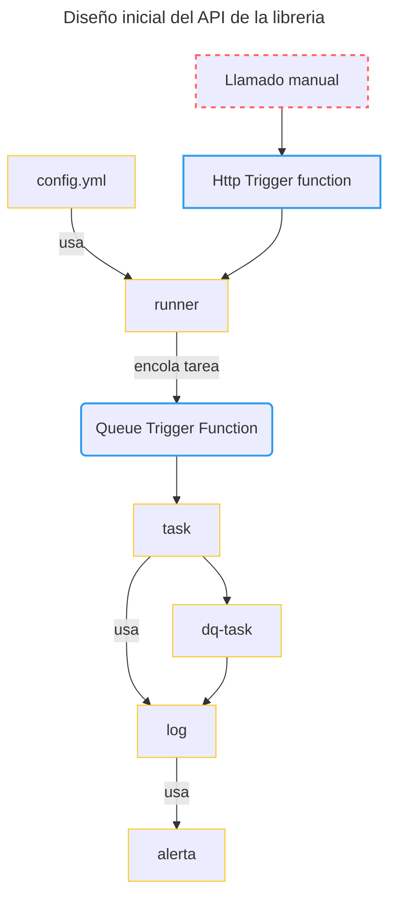

# centraal-dataframework

`centraal-dataframework` es una libreria de python que implementa practicas para usar de manera eficiente [azure function](https://azure.microsoft.com/en-us/products/functions#:~:text=Azure%20Functions%20is%20an%20event,highest%20level%20of%20hardware%20abstraction.) para ejecutar procesos de transformación y calidad de datos. Los procesos de transformación se ejecutan usando la libreria [pandas](https://pandas.pydata.org/) y las reglas de calidad con [great expectations](https://github.com/great-expectations/great_expectations).


## Comienza a usar el framework

Usa como referencia el [notebook](docs/usage_example.ipynb). Algunos pasos basicos:

1. Instala la libreria:

    `pip install centraal-dataframework`

2. Asegurar la creación de las siguientes variables de ambiente. En el ambiente desarollo local, es recomendado usar un archivo `.env` y la libreria [python-dotenv](https://pypi.org/project/python-dotenv/). Ya con la function app desplegada estas variables deben estar configuradas en los [Application settings](https://learn.microsoft.com/en-us/azure/azure-functions/functions-how-to-use-azure-function-app-settings?tabs=portal).

    - AZURE_STORAGE_CONNECTION_STRING: string de conexión al datalake
    - CONTENEDOR_VALIDACIONES: donde se contienen las validaciones que van ser realizadas por great expectations.

3. Crea tus tareas, usando el decorador necesario, `task_dq` o `task`. Usar como referencia el [notebook en la documentación](docs/usage_example.ipynb)
```
4. Cree el archivo de configuración `yaml`, por defecto este archivo se buscara en el directorio de trabajo bajo el nombre `centraal_dataframework.yaml`

```yml
#---contenido de config.yaml---
url_logicapp_email: https://prod-33.eastus.logic.azure.com:443/workflows/xxxxx
emails_notificar: 
    - nombre.appelido@centraal.studio
    - nombre.appelido@correo.com
    ...
tareas:
    # deben tener el nombre de la función definida.
    nombre_funcion:
        dias: '*'
        horas: 8,12,20
    segundo_nombre_funcion:
        dias:  0
        horas: 8,12,20
```
> Nota: tener en cuenta que '*' puede ser usada en dias y horas, para indicar que la tarea debe ser ejecutada cada hora/dia.  Algunos ejemplos para entender como trabaja:

- `dias: '*'` y `horas: '*'` - > ejecutar todos los dias, cada hora.
- `dias: '*'` y `horas: '12'` - >  ejecutar todos los dias **solo** a las 12.
- `dias: '*'` y `horas: 1,8,12,15` - > ejecutar todos los dias **solo** a las 1, 8 a las 12 y a las 15:00 (3 pm).
- `dias 0,3,6` y `horas: '*'` - > ejectutar **solo** los Lunes (0), Jueves(3) y Domingo(6) cada hora.
- `dias: 1,4` y `horas: 20` - > ejectutar **solo** los Lunes (0), Jueves(3) y Domingo(6)  a las 20:00.


5. Crear la function app, adiciona el framework y tareas:

```python
"""---contenido de function_app.py --- """
import azure.functions as func 
from centraal_dataframework.blueprints import framework
# se deben importar los modulos custom
from other.module.logica_pandas import *
from other.module.logica_calidad import *
# si tiene otro modulo tambien importarlo
# form otro.modulo import logica
# ...
app = func.FunctionApp()
#Adicionar el framework
app.register_functions(framework) 
```

6. Desplega la azure function. -> proximamente documentación y herramientas para facilitar este proceso.

## Arquitectura

La arquitectura general de la libreria esta basada en los siguientes servicios:


El diseño inical del API de la libreria se comopone de los siguientes objetos:

1. config.yml
2. runner
3. task
    1. log
    2. alerta
4. dq-task: es un tipo de `task` especifica para reportar tareas de calidad de datos (`dq`).



# PyPI Release Checklist

> NOTA: basado en [check list del template original](https://waynerv.github.io/cookiecutter-pypackage/pypi_release_checklist/).

## Before Your First Release

You better visit PyPI to make sure your package name is unused.

## For Every Release

0.  Make some pull requests, merge all changes from feature branch to master/main.

1.  Update CHANGELOG.md manually. Make sure it follows the [Keep a Changelog](https://keepachangelog.com/en/1.0.0/) standard.
    Be noticed that GitHub workflow will read changelog and extract release notes automatically.

2.  Commit the changelog changes:

    > ``` bash
    > git add CHANGELOG.md
    > git commit -m "Changelog for upcoming release 0.1.1."
    > ```

3.  Update version number and automatically create a commit, tag(can also be patch or major).

    > ``` bash
    > poetry run bump2version minor
    > ```

4.  Run the tests locally for insurance:

    > ``` bash
    > poetry run tox
    > ```

5.  Push these commits to master/main:

    > ``` bash
    > git push
    > ```

    Before proceeding to the next step, please check workflows triggered by this push have passed.

6.  Push the tags(created by bump2version) to master/main, creating the new release on both GitHub and PyPI:

    > ``` bash
    > git push --tags
    > ```

    Only tag name started with 'v'(lower case) will leverage GitHub release workflow.

7.  Check the PyPI listing page to make sure that the README, release
    notes, and roadmap display properly. If tox test passed, this should be ok, since
    we have already run twine check during tox test.

## About This Checklist

This checklist is adapted from <https://cookiecutter-pypackage.readthedocs.io/en/latest/pypi_release_checklist.html>.

It assumes that you are using all features of Cookiecutter PyPackage.


